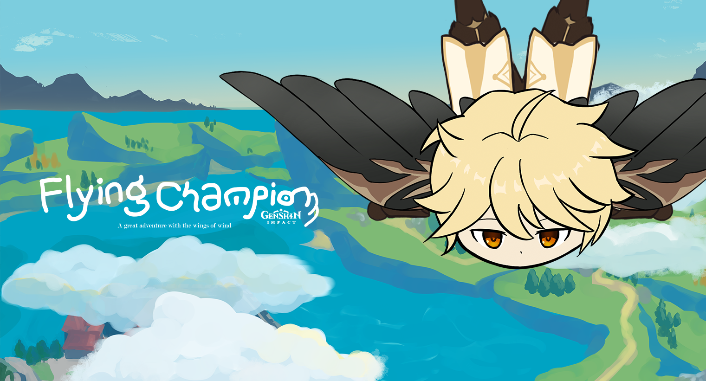
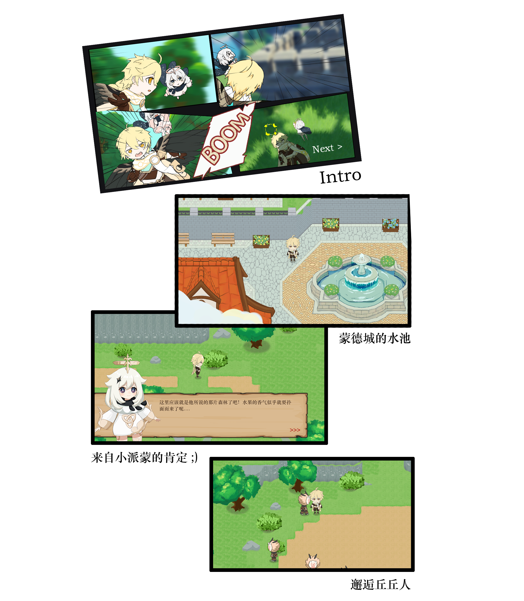

# 原神: 飞行冠军 !

### Flying Champion Game 2022

  

欢迎你, 捕风的异乡人! 

这里是一个画风清奇可爱的原神同人小游戏. 新一届的蒙德城飞行比赛开幕了, 旅行者和小派蒙误打误撞的卷入了这场游戏. 等待他们的会是什么样冒险呢?

  

## 快速体验

我们为你准备了WebGL版的在线试玩Demo. Demo包括了自开头起始的一小段内容, ~~并有可能存在一定的bug~~. 你可以直接点击本项目的Page界面试玩, 或访问下方的超链接:

[Unity WebGL Player | Flying Champion！ (flying-champion-organizing-committee.github.io)](https://flying-champion-organizing-committee.github.io/Flying-Champion.github.io/)

> 操作方式: WASD - 移动角色 // F - 交互/对话 // 鼠标左键 - 挥动武器
>
> 警告: 请勿在酒吧里点炒饭, 以免出现预期流程外的bug.

## 游戏内容

<飞行冠军> 是卡通风格的俯视角2DRPG游戏. 在试玩版中, 您可以体验到游戏的基本交互设计, 特色玩法<滑翔>, 一段可爱的多分支剧情和三张游戏地图. 

在冒险中多多留意! 地图中将有许多方便旅行者的隐藏路线...

> 角色

角色基于骨骼动画打造, 具有丰富的动作和四个可控制方向.

> 滑翔

作为游戏的特色玩法和对主题的呼应, 我们设计并制作了旅行者的"滑翔"行为. 这个特别的玩法允许玩家在特定地点乘风而起, 并绕过障碍在地图中穿梭. 作为对构造更新颖游戏流程的尝试, 我们据此特殊设计了游戏的场景地图.  

> 剧情

我们使用可配置数据文件实现了剧情编辑器. 在对话中选择不同的选项将能够引发不同的事件和后续对话!

  

## 玩法和技术

为了完成我们的游戏并给玩家带来更好的体验, 开发者研究并实现了一些特色算法和功能. 您可以在开发者的个人网站上更详细的了解它们:

> 打造具有"Y轴"的2D Top-Down游戏: https://shthemw.gitee.io/2024/03/09/%E6%89%93%E9%80%A0%E5%85%B7%E6%9C%89-Y%E8%BD%B4-%E7%9A%842D-top-down%E6%B8%B8%E6%88%8F/

## 开发者名单

程序 - @SHthemW

角色 - @Moonlight

场景 - @rinya

后期 - @Biene726

音频 - @Arnold-3
